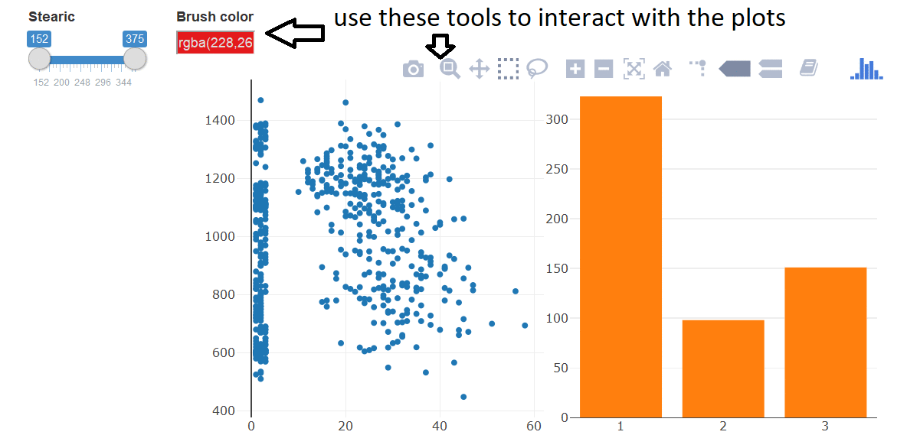

##Introduction
This is a sample report that shows my data visualization skill. In this report, I'll use different types of plot, which suitable with each dataset in order to figure out some characteristics about the data set.

```{r setup,echo=FALSE, warning=FALSE, message=FALSE, include=FALSE}
#setting
library(ggplot2)
library(plotly)
library(crosstalk)
library(tidyr)
library(GGally)
knitr::opts_chunk$set(echo = TRUE, warning=FALSE, message=FALSE, include=TRUE)
```

## 1. Interactive link-plots for firgure out clusters
### 1.1 Drescription about the data and the mission
In this section, I use the data about olive in Italy. Olive data has 572 records. It contains infomation about the area which it is planted and index for 8 good acids that it has.
Here is the overview of olive data (palmitic, stearic, oleic... is the name of acids)

```{r}
#1.1
path1 <- "olive.csv"
olive <- read.csv(path1)
head(olive)
```
My mission is figuring out which is the characteristics of olive in each Region. Region 1 includes North-Apulia, Calabria, South-Apulia, and Sicily. Region 2 has Inland-Sardinia and Coast-Sardinia. Umbria and East-Liguria belonged to region 3.

For this purpose, I'll use different types of basic plots (scatter plot, line plot, coordinate plot) which is linked with the others. The plots are interactable, which mean you can use brushing, zoom in/out or see the specific value of each point by moving your mouse on it.

###1.2 How linked interactive plots work
To demonstrate how to use and interact with plot. I create a scatter plot between eicosenoic and linoleic, then link it with a bar chart which show region. a slider is add to fillter value base on stearic.
```{r}

#1.2
#Create Share data
olive_shared <- SharedData$new(olive)

#Scatter plot
scatter_olive <- plot_ly(olive_shared, type = "scatter", x = ~eicosenoic, y = ~linoleic)

#Bar plot
bar_olive <-plot_ly(olive_shared, x=~Region)%>%add_histogram()%>%layout(barmode="overlay")

#Add slider and show 2 plots
bscols(widths=c(2, NA),filter_slider("R", "Stearic", olive_shared, ~stearic),
       subplot(scatter_olive,bar_olive)%>%
         highlight(on="plotly_select", dynamic=T, persistent = T, opacityDim = I(1))%>%hide_legend())

```
We can zoning, brushing, zoom in/out choosing some special point .. to interact with the plot. Let's see the below gif as an example.




### 1.3 Link betwwen parallel coordinates plot and bar plot
Now, I'll show how to use visualization skill to analysis the data. Because we have 8 kinds of acids, so a good ideal is using parallel coordinates plot, which can show an overview of all kind of acids. I also link it with a bar chart that shows 3 regions and a 3D scatter plot with a dropdown (for seeing the clusters)

```{r}
#1.2
olive$Region <- as.factor(olive$Region)
#create shared data
olive_shared <- SharedData$new(olive)


#Bar chart

olive_acids<-ggparcoord(olive, columns = c(4:11))
d<-plotly_data(ggplotly(olive_acids))%>%group_by(.ID)
d1<-SharedData$new(d, ~.ID, group="olive")
coordinates_olive<-plot_ly(d1, x=~variable, y=~value)%>%
  add_lines(line=list(width=0.3))%>%
  add_markers(marker=list(size=0.3),
              text=~.ID, hoverinfo="text")

bar_olive<-plot_ly(d1, x=~factor(Region) )%>%add_histogram()%>%layout(title= "Interactive link-plots", barmode="overlay")

ButtonsX=list()
for (i in 2:11){
  ButtonsX[[i-1]]= list(method = "restyle", 
                        args = list( "x", list(olive[[i]])),
                        label = colnames(olive)[i])
}
ButtonsY=list()
for (i in 2:11){
  ButtonsY[[i-1]]= list(method = "restyle",
                        args = list( "y", list(olive[[i]])),
                        label = colnames(olive)[i])
}
ButtonsZ=list()
for (i in 2:11){
  ButtonsZ[[i-1]]= list(method = "restyle",
                        args = list( "z", list(olive[[i]])),
                        label = colnames(olive)[i])
}
olive2=olive[, 2:11]
olive2$.ID=1:nrow(olive)
d2<-SharedData$new(olive2, ~.ID, group="olive")
olive_3d <- plot_ly(d2, x = ~eicosenoic, y = ~linoleic, z= ~oleic, alpha = 0.8) %>%
  add_markers() %>%
  layout(scene = list(
    xaxis=list(title=""), 
    yaxis=list(title=""),
    zaxis=list(title="")
  ),
  updatemenus = list(
    list(y=0.9, buttons = ButtonsX),
    list(y=0.7, buttons = ButtonsY),
    list(y=0.5, buttons = ButtonsZ) 
  ) 
  )

#show
ps<-htmltools::tagList(bar_olive%>%
                         highlight(on="plotly_select", dynamic=T, persistent = T, opacityDim = I(1))%>%
                         hide_legend(),
                       coordinates_olive%>%
                         highlight(on="plotly_select", dynamic=T, persistent = T, opacityDim = I(1))%>%
                         hide_legend(),
                       olive_3d%>%
                         highlight(on="plotly_select", dynamic=T, persistent = T, opacityDim = I(1))%>%
                         hide_legend()
)
htmltools::browsable(ps)
```

I'll brush each region in the bar chart and see the characteristics of each region in the second plot. See the pictures below. 


All the oils from region 3 have low values of eicosenoic and linoleic, as well as the high values of oleic. The acids' values of oils from region 1 are opposite to those from region 3. In addition, the oils from region 2 have similar values for eicosenoic with oils from region 1 but have the lower value for linoeic and higher for oleic.
The parallel coordinate plot demonstrates the distinguishment of oils from different regions. By choosing these elements (picture 1.2.3), we can see three different clusters quite clearly.
To sum up, eicosenoic, linoleic and oleic are the three most influential variables to distinguish those regions.


## 2. Trellis plots for seeing effects of different factors
### 2.1 Drescription about the data and the mission
In this section, I use the population data. It contains information about age, income, marital status, education levels... of 32560 people in the world.
My mission is figuring out how the income of each person is affected by age and marital status.
Here is an overview of the data. 
```{r}
#2.1
path2 <- "adult.csv"
population <- read.csv(path2)

names(population) <- c("age", "workClass", "popuIndex", "education", "educationNum", "marital", "occupation", "relationship", "race", "sex", "capitalGain", "capitalLoss", "workHours", "country", "income")
head(population)
```

### 2.2 Age and income of people

```{r}
#2.2
p2.2.1 <- ggplot(population, aes(x=age, y=workHours,colour = income)) + 
  geom_point()+
  scale_color_manual(values = c("red", "black")) +
  ggtitle("Scatter plot of age versus income") +
  theme_bw()
p2.2.1
```

Here is the scatter plot of age versus income. It doesn't have a good visual, so I split it into two plots based on the income levels.
```{r}

p2.2.2 <- p2.2.1 + facet_grid(income~.)
p2.2.2
```

Now, the graphs are more clearly. Most of the rich people (income>50k) are more than 24 years old. They also don't work too much or too litter ( not more than 80 hours per week or less than 20 hours).
On the other hand, the graph of poor people is understandable. People those under 20 maybe don't work, which mean that they don't have any income. About one third only work under 25 hours per week, maybe they just have a part-time work. others may have a low salary, so they need to work a lot to cover the live expend. It leads to the range of this plot is higher than the plot of rich people.

### 2.3 Trellis plot for age versus income versus 
```{r}
#2.3
p2.3.1 <- ggplot()+
  geom_density(data=population, aes(x=age, group=income, fill=income),alpha=0.5, adjust=2) + 
  xlab("Age") +
  ylab("Density") +
  theme_bw()+
  ggtitle("Density plot")
p2.3.1
p2.3.2 <- p2.3.1 + facet_wrap(marital~.) 
p2.3.2

```

The trellis plot shows how marital status affect to income of people. The main difference is for people who never-married and Married-spouse-absent. Most of the poor people in this group are young, while the rich are older. Maybe the rich don't spend too much time for their family and focus on their career, which makes them become richer. To be more specific, not so many poor poeple are still never-married after around 30 years old. It might mean that their marital status are changed, most of them are for example married after 25 years old.
The density plot for divorced, seperated and widowed are approximately similar between the two groups, which mean that they don't make any efftect to imcome of a person. 

## 3. Animations of time series data
### 3.1 Drescription about the data and the mission
In this section, I use the OilCoal data. It contains information about the consumption of oil (million tonnes) and coal (million tonnes oil equivalents) in 8 different coutries. Marker size shows how large a country is (1 for China and the US, 0.5 for all other countries). 
```{r}
#2.3
path3 <- "Oilcoal.csv"
Oilcoal <- read.csv2(path3)
Oilcoal <- Oilcoal[,-6]
head(Oilcoal)
```

### 3.2 Time series plot and motion plot.
The first plot is the time series plot for Coal consumption. We can see that China and Us consumption more than other countries. These countries also show an upward trend. In contrast, the numbers for others are quite stable.
You can kick on the legend on the right-hand side to remove some countries, or show just only one country.

```{r}
pal <- c("red", "blue", "darkgreen", "black", "yellow", "purple", "pink", "orange")
plot_ly(Oilcoal, x =~Year, y=~Coal,split =~Country, color = ~Country, colors = pal, type = "scatter", mode= "lines") %>% layout("Time series plot")
```

To see how the consumption is changed in the 45 year periods, please kick on the play button on the left bottom conner.
```{r}

p2.1 <- Oilcoal %>%
  plot_ly(
    x = ~Coal, 
    y = ~Oil, 
    size = ~Marker.size, 
    color = ~Country, 
    colors = pal,
    frame = ~Year, 
    text = ~Country, 
    hoverinfo = "text",
    type = 'scatter',
    mode = 'markers'
  ) %>%
  layout("Animated bubble chart of Coal versus Oil")


p2.1

```

## Conclusion

These are three examples of how I can use visualization skill to draw and discover some useful information about the data. The data I used for this report is quite clean and easy to analyze. I skill for preprocessing data like cleaning, normalization, sampling, dimension reduction...

This report is written by R markdown. Plots are drawn by using R programing language. You can find the source code for this report at [GitHub](https://github.com/DucDuong92/Data-Visualization-sample)

Last words, I'm a second-year master student at Ca' Foscari University of Venice (Italy) and Linköping University (Sweden) (Erasmus+ program) I'm looking for both Internship and full-time positions in Europe. 
Here is my LinkedIn profile: [link](https://www.linkedin.com/in/duong-minh-duc-a67057a2/)

##Apdendix
Please put the `code` button to see the code of this report.
```{r, ref.label=knitr::all_labels(), echo=TRUE, eval=FALSE}

```